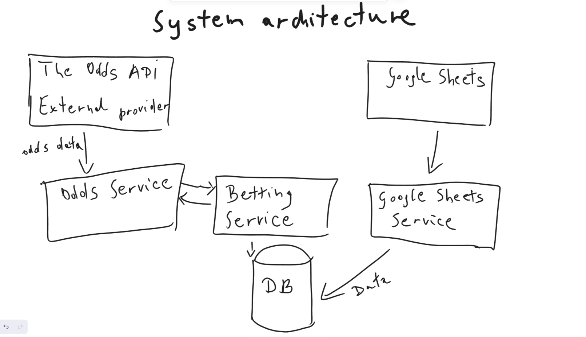
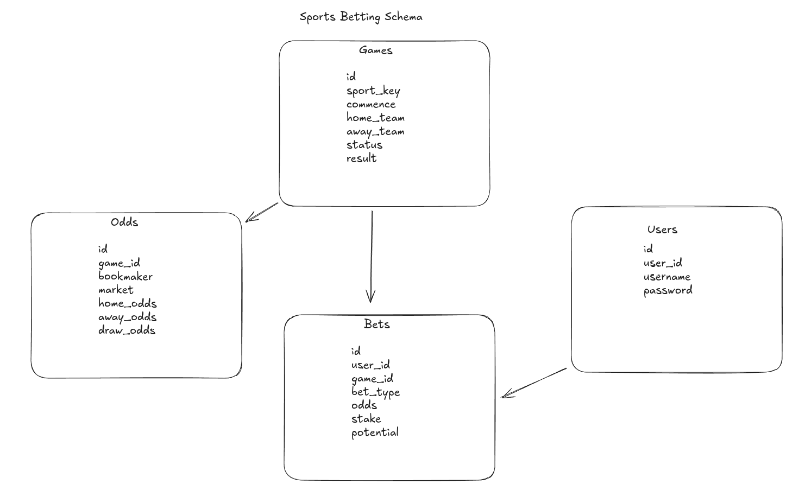

# Architecture - brain dump

  

Sorry, that the picture is not perfect.

Given the extensive nature of this task, I have chosen a clear strategy to demonstrate my thought process and outcomes. My approach is to first present an overview of the solution’s big picture and overall architecture. From there, I will progressively break down the solution into smaller components and modules, providing increasing levels of detail at each step.

Please keep in mind that this is a high-level overview of the solution. As an engineer at heart, I’m compelled to simplify certain aspects due to time constraints. I do not mention such aspects (important) like:

- all kinds of testing like unit tests, integration tests, E2E
- security aspects like XSS, authorization, authentication
- technical details like Entity Relationship Diagram - database diagram
- technical details of REST services
- deployment and maintenance of the microservices
- caching for fetched data to speed up the whole application
- containerization of every microservice
- monitoring in Prometheus

Although I make simplifications, I want to share my suggestions how to make the system better:

- caching data to make working while application is offline

# Description of the diagram

Let's start from the bottom.

- Database - this is the central module of the system, stores information about: games, odds, bets, users

- Odds Microservice - pulls odds, generates results

- The Odds API - external odds provider, fetches odds data

- Betting Microservice - managing bets and user status

- Google Sheets Microservice - user interface integration

# Database

  

I assume that design of database should deliver following capabilities:

- A user can place multiple bets, but each bet is placed by only one user.

- Each game can have multiple odds entries (for different markets or bookmakers).

- Each bet is placed on a specific game; a game can have many bets placed on it.

- Each bet references a specific odds entry (e.g., home win, draw, away win for a game).

- Each odds entry is associated with one game.

- Each bet is associated with one user.

- Each bet is associated with one game.

- Each bet is associated with one specific odds entry.
